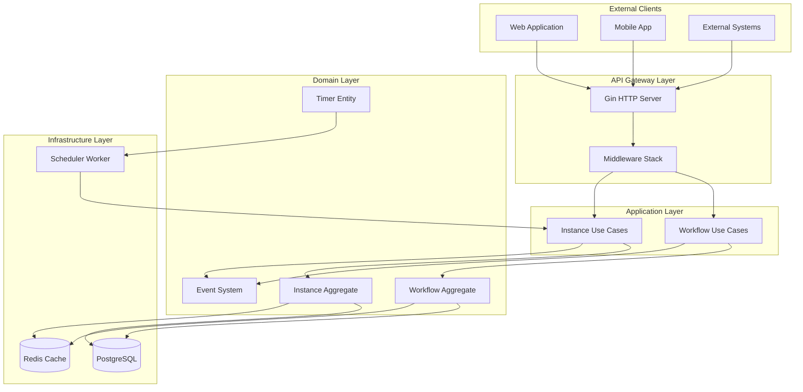
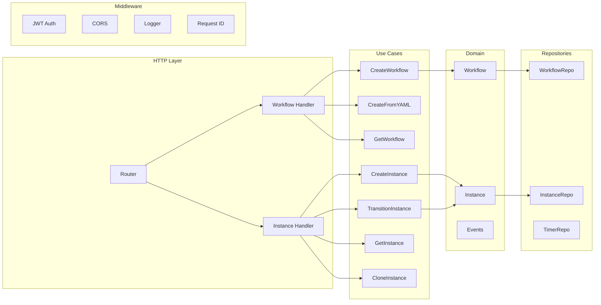
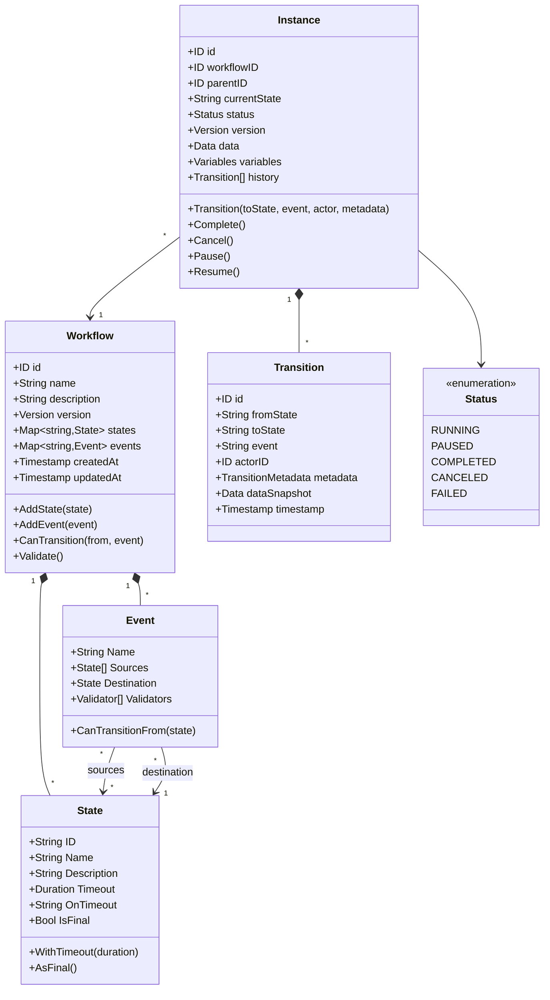
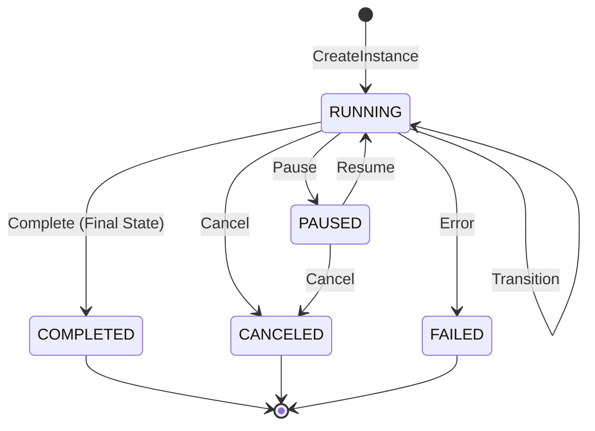
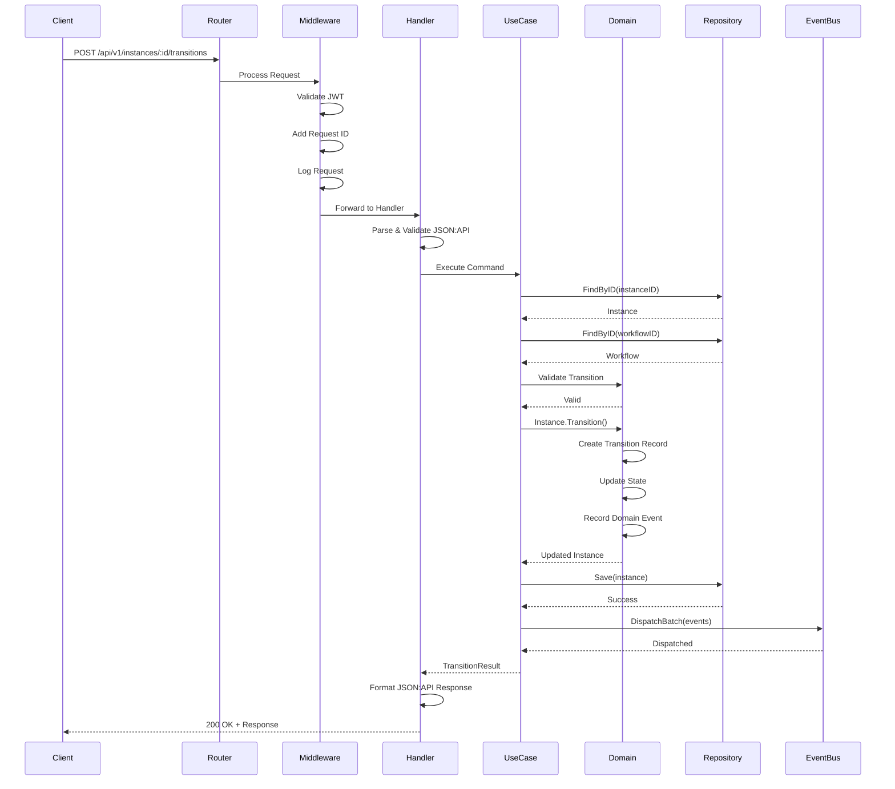
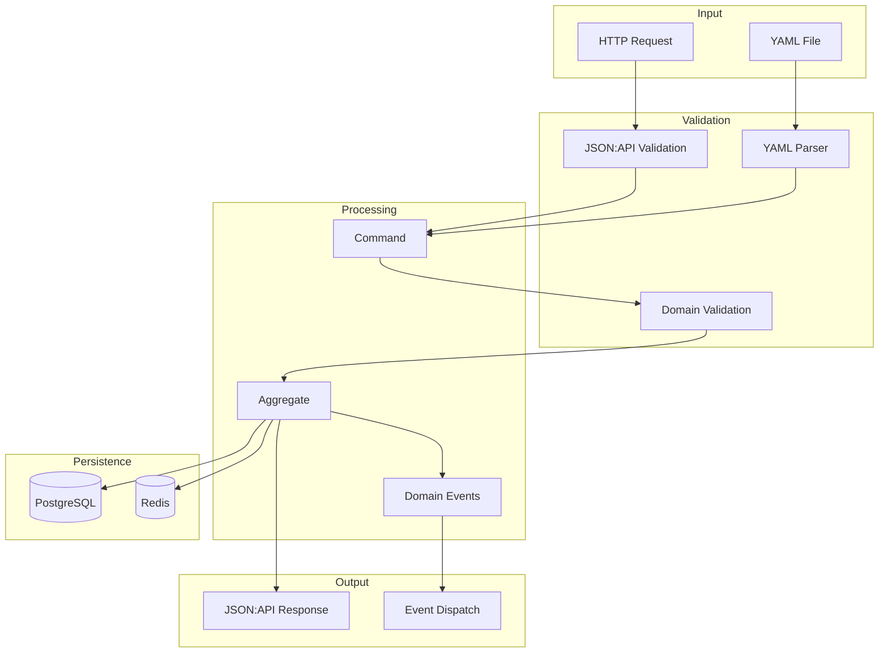
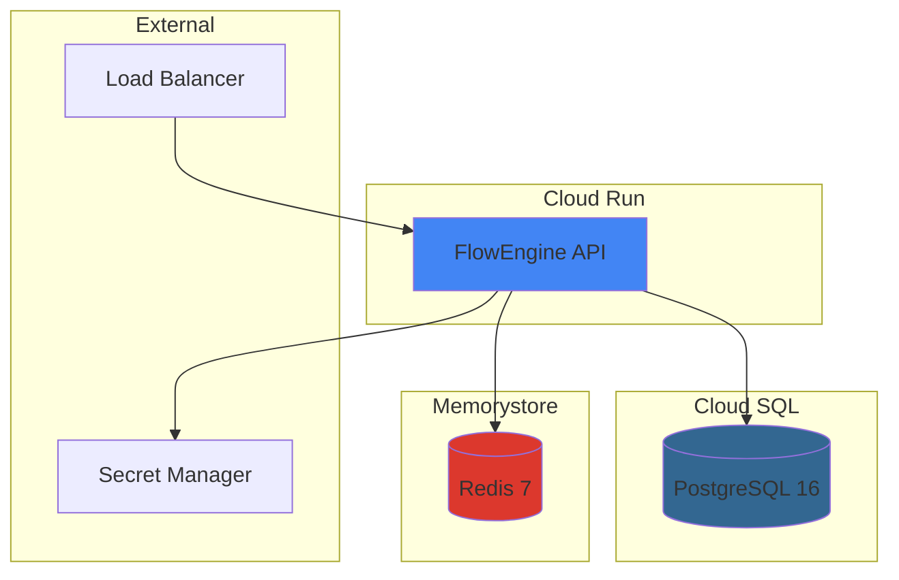

# FlowEngine - Architecture Documentation

## System Overview

FlowEngine es un motor de workflows empresarial diseñado con arquitectura hexagonal (Clean Architecture) para gestión documental con soporte específico para flujos MinTrabajo.

## High-Level Architecture



## Component Architecture



## Domain Model



## State Machine Flow



## Request Flow



## Data Flow Architecture



## Directory Structure

```
FlowEngine/
├── cmd/
│   ├── api/              # REST API Server
│   │   └── main.go
│   ├── emulator/         # Workflow Testing Tool
│   ├── demo/             # Demo Utilities
│   └── quick-test/       # Quick Testing
│
├── internal/
│   ├── domain/           # Business Logic (Core)
│   │   ├── workflow/     # Workflow Aggregate
│   │   ├── instance/     # Instance Aggregate
│   │   ├── event/        # Domain Events
│   │   ├── timer/        # Timer Entity
│   │   └── shared/       # Value Objects
│   │
│   ├── application/      # Use Cases
│   │   ├── workflow/     # Workflow Operations
│   │   └── instance/     # Instance Operations
│   │
│   └── infrastructure/   # External Adapters
│       ├── http/         # REST API
│       │   ├── handler/
│       │   ├── middleware/
│       │   └── router/
│       ├── persistence/
│       │   ├── postgres/
│       │   └── memory/
│       ├── cache/        # Redis
│       ├── parser/       # YAML Parser
│       ├── security/     # JWT
│       └── scheduler/    # Timer Worker
│
├── pkg/                  # Public Packages
│   ├── jsonapi/          # JSON:API Helpers
│   └── logger/           # Logging
│
├── config/
│   └── templates/        # YAML Workflow Templates
│
├── migrations/           # Database Migrations
├── scripts/              # Utility Scripts
└── docs/                 # Documentation
```

## Deployment Architecture



## Technology Stack

| Layer | Technology | Purpose |
|-------|------------|---------|
| HTTP Framework | Gin | High-performance REST API |
| Database | PostgreSQL 16 | Primary persistence |
| Cache | Redis 7 | Response caching & sessions |
| Authentication | JWT (HMAC-SHA256) | API security |
| Configuration | Environment Variables | 12-factor app |
| Logging | Structured JSON | Observability |
| API Format | JSON:API v1.0 | Standard response format |
| Workflow Definition | YAML | Human-readable configs |

## Key Design Patterns

1. **Hexagonal Architecture**: Clear separation between domain, application, and infrastructure
2. **Domain-Driven Design**: Aggregates, Value Objects, Domain Events
3. **Repository Pattern**: Data access abstraction
4. **Command/Query Separation**: Use cases follow CQRS principles
5. **Event Sourcing Ready**: Domain events for state changes
6. **Optimistic Locking**: Version-based concurrency control

## Security Considerations

- JWT Bearer token authentication
- CORS configuration
- Request ID tracking for audit
- No sensitive data in logs
- Secret Manager integration for production
- SQL injection prevention via parameterized queries

## Scalability Features

- Stateless API design (Cloud Run compatible)
- Connection pooling (PostgreSQL)
- Redis caching layer
- Horizontal scaling support
- Graceful shutdown handling
