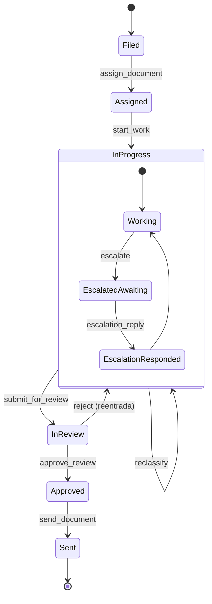

# Sistema de Estados para Personas (Documentos/Solicitudes)

## Versión
- **Versión**: 1.0
- **Fecha**: 2025-11-05
- **Autor**: Claude Agent

## 1. Overview

Este documento describe el sistema de estados para documentos/solicitudes (personas) dentro de FlowEngine, diseñado para soportar flujos complejos de radicación con:

- ✅ **Estados jerárquicos** con subestados
- ✅ **Transiciones especiales** (Escalate, Reclassify, Reject)
- ✅ **Guards de permisos** basados en roles
- ✅ **Auditoría completa** con usuario y timestamp
- ✅ **Eventos para webhooks** en cada transición
- ✅ **Reentrada de estados** (loops permitidos)

### 1.1 Entidad Principal

**Documento/Solicitud/PQRD** que se mueve por estados:
- La entidad es el documento (representado por `workflow_instance`)
- Los **usuarios/roles** son los **actores** que ejecutan transiciones
- El sistema captura quién hizo qué y cuándo

### 1.2 Flujo Principal

```
Filed (Radicación)
  ↓
Assigned (Asignación)
  ↓
InProgress (Gestión) ← ─ ─ ─ ┐
  ├─ EscalatedAwaitingResponse    │ Reject
  └─ EscalationResponded          │
  ↓                               │
InReview (Revisión) ─ ─ ─ ─ ─ ─ ─ ┘
  ↓
Approved (Aprobación)
  ↓
Sent (Enviado) [FINAL]
```

---

## 2. Estados del Sistema

### 2.1 Estados Principales

#### Filed (Radicación)
- **ID**: `filed`
- **Nombre**: Radicación
- **Descripción**: Estado inicial cuando se recibe un documento
- **Timeout**: 24 horas
- **Roles permitidos**: `radicador`
- **Acciones permitidas**:
  - `GenerateIDNumber`: Generar número de radicado
  - `Assign`: Asignar a usuario/grupo
- **Estado final**: No

#### Assigned (Asignado)
- **ID**: `assigned`
- **Nombre**: Asignado
- **Descripción**: Documento asignado a un gestor
- **Timeout**: 12 horas
- **Roles permitidos**: `radicador`, `asignador`
- **Acciones permitidas**:
  - `StartWork`: Iniciar gestión
  - `Reassign`: Reasignar a otro gestor
- **Estado final**: No

#### InProgress (En Gestión)
- **ID**: `in_progress`
- **Nombre**: En Gestión
- **Descripción**: Documento siendo gestionado
- **Timeout**: 48 horas
- **Roles permitidos**: `gestionador`
- **Subestados**:
  - `working` (default)
  - `escalated_awaiting_response`
  - `escalation_responded`
- **Acciones permitidas**:
  - `SubmitForReview`: Enviar a revisión
  - `Escalate`: Escalar a departamento
  - `Reclassify`: Reclasificar documento
- **Estado final**: No
- **Reentrada**: Permitida desde `in_review` (vía Reject)

#### InReview (En Revisión)
- **ID**: `in_review`
- **Nombre**: En Revisión
- **Descripción**: Documento en proceso de revisión de calidad
- **Timeout**: 12 horas
- **Roles permitidos**: `revisor`
- **Acciones permitidas**:
  - `Approve`: Aprobar revisión
  - `Reject`: Rechazar y devolver a gestión
- **Estado final**: No

#### Approved (Aprobado)
- **ID**: `approved`
- **Nombre**: Aprobado
- **Descripción**: Documento aprobado, listo para envío
- **Timeout**: 12 horas
- **Roles permitidos**: `aprobador`
- **Acciones permitidas**:
  - `Send`: Enviar documento
- **Estado final**: No

#### Sent (Enviado)
- **ID**: `sent`
- **Nombre**: Enviado
- **Descripción**: Documento enviado (completado)
- **Timeout**: N/A
- **Roles permitidos**: N/A
- **Estado final**: Sí

### 2.2 Subestados (dentro de InProgress)

Los subestados permiten tracking detallado dentro del estado `in_progress`:

```go
type SubState string

const (
    SubStateWorking                    SubState = "working"
    SubStateEscalatedAwaitingResponse  SubState = "escalated_awaiting_response"
    SubStateEscalationResponded        SubState = "escalation_responded"
)
```

**Transiciones de subestados**:
- `working` → `escalated_awaiting_response` (trigger: `Escalate`)
- `escalated_awaiting_response` → `escalation_responded` (trigger: `EscalationReply`)
- `escalation_responded` → `working` (automático o manual)

---

## 3. Transiciones del Sistema

### 3.1 Transiciones Normales

| Evento | Desde | Hasta | Guard | Acción |
|--------|-------|-------|-------|--------|
| `FileDocument` | - | `filed` | - | Crear instancia, generar ID |
| `AssignDocument` | `filed` | `assigned` | `hasRole(radicador)` | Asignar a gestor |
| `StartWork` | `assigned` | `in_progress` | `hasRole(gestionador)` | Iniciar gestión |
| `SubmitForReview` | `in_progress` | `in_review` | `hasRole(gestionador)` | Enviar a revisión |
| `ApproveReview` | `in_review` | `approved` | `hasRole(revisor)` | Aprobar |
| `SendDocument` | `approved` | `sent` | `hasRole(aprobador)` | Enviar |

### 3.2 Transiciones Especiales

#### Escalamiento (Escalate)

```go
type EscalateCommand struct {
    InstanceID   string
    DepartmentID string
    Reason       string
    ActorID      string
}
```

**Flujo**:
1. Desde `in_progress` (substate `working`)
2. Trigger `Escalate(departmentID, reason)`
3. Cambiar substate a `escalated_awaiting_response`
4. Crear registro de escalamiento
5. Emitir evento `DocumentEscalated`
6. Esperar respuesta

**Respuesta de Escalamiento**:
1. Trigger `EscalationReply(data)`
2. Cambiar substate a `escalation_responded`
3. Emitir evento `EscalationReplied`

#### Reclasificación (Reclassify)

```go
type ReclassifyCommand struct {
    InstanceID   string
    NewType      string // "PQRD" o "Control"
    Reason       string
    ActorID      string
}
```

**Flujo**:
1. Desde `in_progress`
2. Guard: `canReclassify(actor, currentType, newType)`
3. Actualizar metadata del documento
4. Emitir evento `DocumentReclassified`
5. Permanecer en `in_progress`

**Tipos de reclasificación**:
- `ReclassifyToPQRD`: Reclasificar a PQRD
- `ReclassifyToControl`: Reclasificar a Control

#### Rechazo (Reject)

```go
type RejectCommand struct {
    InstanceID string
    Reason     string
    Feedback   string
    ActorID    string
}
```

**Flujo**:
1. Desde `in_review`
2. Trigger `Reject(reason)`
3. Transición de vuelta a `in_progress` (reentrada)
4. Resetear substate a `working`
5. Agregar feedback a variables
6. Emitir evento `DocumentRejected`

---

## 4. Sistema de Roles y Permisos

### 4.1 Roles del Sistema

```go
type Role string

const (
    RoleRadicador    Role = "radicador"
    RoleAsignador    Role = "asignador"
    RoleGestionador  Role = "gestionador"
    RoleRevisor      Role = "revisor"
    RoleAprobador    Role = "aprobador"
)
```

### 4.2 Matriz de Permisos

| Rol | Estados Accesibles | Transiciones Permitidas |
|-----|-------------------|------------------------|
| `radicador` | `filed`, `assigned` | FileDocument, AssignDocument |
| `asignador` | `assigned` | AssignDocument, Reassign |
| `gestionador` | `in_progress` | StartWork, SubmitForReview, Escalate, Reclassify |
| `revisor` | `in_review` | ApproveReview, Reject |
| `aprobador` | `approved` | SendDocument |

### 4.3 Guards de Permisos

```go
type PermissionGuard struct {
    requiredRole    Role
    customValidator func(ctx context.Context, actor Actor, instance Instance) error
}

// Ejemplos de guards
func HasRole(requiredRole Role) Guard {
    return &PermissionGuard{
        requiredRole: requiredRole,
        customValidator: func(ctx context.Context, actor Actor, instance Instance) error {
            if !actor.HasRole(requiredRole) {
                return ErrInsufficientPermissions
            }
            return nil
        },
    }
}

func CanReclassify(actor Actor, currentType, newType string) Guard {
    return &PermissionGuard{
        customValidator: func(ctx context.Context, actor Actor, instance Instance) error {
            // Validación de negocio específica
            if currentType == newType {
                return errors.New("cannot reclassify to same type")
            }

            // Solo gestionadores senior pueden reclasificar
            if !actor.HasRole(RoleGestionador) || !actor.IsSenior() {
                return ErrInsufficientPermissions
            }

            return nil
        },
    }
}
```

---

## 5. Auditoría y Tracking

### 5.1 Información Capturada

Cada transición registra:

```go
type Transition struct {
    ID           UUID
    InstanceID   UUID
    Event        string
    FromState    string
    ToState      string
    FromSubState string      // Nuevo campo
    ToSubState   string      // Nuevo campo

    // Auditoría
    ActorID      string      // Usuario que ejecutó
    ActorRole    string      // Rol del usuario
    Timestamp    time.Time   // Cuándo se ejecutó

    // Metadata adicional
    Data         map[string]interface{}
    Reason       string      // Para Reject, Escalate
    DurationMs   int
}
```

### 5.2 Schema PostgreSQL Actualizado

```sql
ALTER TABLE workflow_transitions ADD COLUMN from_sub_state VARCHAR(100);
ALTER TABLE workflow_transitions ADD COLUMN to_sub_state VARCHAR(100);
ALTER TABLE workflow_transitions ADD COLUMN reason TEXT;

-- Índice para auditoría
CREATE INDEX idx_transitions_actor_time
ON workflow_transitions(actor, created_at DESC);

-- Índice para búsqueda de rechazos
CREATE INDEX idx_transitions_event_type
ON workflow_transitions(event, from_state, to_state);
```

### 5.3 Tabla de Escalamientos

```sql
CREATE TABLE workflow_escalations (
    id UUID PRIMARY KEY DEFAULT gen_random_uuid(),
    instance_id UUID NOT NULL REFERENCES workflow_instances(id) ON DELETE CASCADE,
    transition_id UUID REFERENCES workflow_transitions(id),

    department_id VARCHAR(100) NOT NULL,
    reason TEXT NOT NULL,
    escalated_by VARCHAR(255) NOT NULL,
    escalated_at TIMESTAMP NOT NULL DEFAULT NOW(),

    response TEXT,
    responded_by VARCHAR(255),
    responded_at TIMESTAMP,

    status VARCHAR(50) NOT NULL DEFAULT 'pending', -- pending, responded, closed

    created_at TIMESTAMP NOT NULL DEFAULT NOW(),
    updated_at TIMESTAMP NOT NULL DEFAULT NOW()
);

CREATE INDEX idx_escalations_instance ON workflow_escalations(instance_id);
CREATE INDEX idx_escalations_status ON workflow_escalations(status) WHERE status = 'pending';
CREATE INDEX idx_escalations_department ON workflow_escalations(department_id, status);
```

---

## 6. Sistema de Eventos

### 6.1 Eventos de Dominio

```go
// Eventos estándar
type DocumentFiled struct {
    InstanceID   string
    DocumentType string
    FiledBy      string
    OccurredAt   time.Time
}

type DocumentAssigned struct {
    InstanceID   string
    AssignedTo   string
    AssignedBy   string
    OccurredAt   time.Time
}

type StateChanged struct {
    InstanceID    string
    FromState     string
    ToState       string
    FromSubState  string
    ToSubState    string
    Event         string
    Actor         string
    OccurredAt    time.Time
}

// Eventos especiales
type DocumentEscalated struct {
    InstanceID   string
    DepartmentID string
    Reason       string
    EscalatedBy  string
    OccurredAt   time.Time
}

type EscalationReplied struct {
    InstanceID   string
    EscalationID string
    Response     string
    RespondedBy  string
    OccurredAt   time.Time
}

type DocumentReclassified struct {
    InstanceID  string
    FromType    string
    ToType      string
    Reason      string
    ActorID     string
    OccurredAt  time.Time
}

type DocumentRejected struct {
    InstanceID  string
    Reason      string
    Feedback    string
    RejectedBy  string
    OccurredAt  time.Time
}

type DocumentApproved struct {
    InstanceID  string
    ApprovedBy  string
    OccurredAt  time.Time
}

type DocumentSent struct {
    InstanceID  string
    SentBy      string
    SentAt      time.Time
}
```

### 6.2 Emisión de Eventos para Webhooks

Cada transición emite eventos que pueden ser consumidos por:
- Webhooks externos
- Event Dispatchers (Webhook, Log)
- Sistemas de notificación
- Analytics

```go
// Configuración de webhook para el workflow
webhooks:
  - url: "https://api.example.com/notifications"
    events:
      - "state.changed"
      - "document.escalated"
      - "document.rejected"
      - "document.sent"
    secret: "webhook-secret-key"
    headers:
      X-Custom-Header: "value"
```

---

## 7. Implementación en Código

### 7.1 Workflow Configuration (YAML)

```yaml
version: "1.0"
workflow:
  id: "person_document_flow"
  name: "Flujo de Radicación de Documentos"
  description: "Sistema de estados para documentos con soporte de escalamiento y reclasificación"
  initial_state: "filed"

  states:
    - id: filed
      name: Radicación
      description: Estado inicial al recibir documento
      timeout: 24h
      on_timeout: escalate_timeout
      allowed_roles:
        - radicador

    - id: assigned
      name: Asignado
      description: Documento asignado a gestor
      timeout: 12h
      on_timeout: escalate_timeout
      allowed_roles:
        - radicador
        - asignador

    - id: in_progress
      name: En Gestión
      description: Documento siendo gestionado
      timeout: 48h
      on_timeout: escalate_timeout
      allowed_roles:
        - gestionador
      substates:
        - working
        - escalated_awaiting_response
        - escalation_responded

    - id: in_review
      name: En Revisión
      description: Revisión de calidad
      timeout: 12h
      on_timeout: escalate_timeout
      allowed_roles:
        - revisor

    - id: approved
      name: Aprobado
      description: Documento aprobado
      timeout: 12h
      on_timeout: escalate_timeout
      allowed_roles:
        - aprobador

    - id: sent
      name: Enviado
      description: Documento enviado
      final: true

  events:
    # Transiciones normales
    - name: file_document
      from: []
      to: filed
      guards: []
      actions:
        - generate_document_id

    - name: assign_document
      from: [filed]
      to: assigned
      guards:
        - has_role:radicador
      actions:
        - assign_to_user
        - notify_assignee

    - name: start_work
      from: [assigned]
      to: in_progress
      guards:
        - has_role:gestionador
        - is_assigned_to_actor
      actions:
        - set_substate:working

    - name: submit_for_review
      from: [in_progress]
      to: in_review
      guards:
        - has_role:gestionador
        - validate_required_fields
      actions:
        - notify_reviewers

    - name: approve_review
      from: [in_review]
      to: approved
      guards:
        - has_role:revisor
      actions:
        - mark_as_approved
        - notify_approvers

    - name: send_document
      from: [approved]
      to: sent
      guards:
        - has_role:aprobador
      actions:
        - send_to_recipient
        - mark_as_completed

    # Transiciones especiales
    - name: escalate
      from: [in_progress]
      to: in_progress  # Permanece en mismo estado
      guards:
        - has_role:gestionador
      actions:
        - create_escalation
        - set_substate:escalated_awaiting_response
        - notify_department

    - name: escalation_reply
      from: [in_progress]
      to: in_progress
      guards:
        - has_role:gestionador
        - validate_escalation_exists
      actions:
        - record_escalation_response
        - set_substate:escalation_responded

    - name: reject
      from: [in_review]
      to: in_progress  # Reentrada permitida
      guards:
        - has_role:revisor
        - validate_rejection_reason
      actions:
        - set_substate:working
        - add_feedback_to_instance
        - notify_manager

    - name: reclassify_to_pqrd
      from: [in_progress]
      to: in_progress
      guards:
        - has_role:gestionador
        - can_reclassify
      actions:
        - update_document_type:pqrd
        - log_reclassification

    - name: reclassify_to_control
      from: [in_progress]
      to: in_progress
      guards:
        - has_role:gestionador
        - can_reclassify
      actions:
        - update_document_type:control
        - log_reclassification

  webhooks:
    - url: "${WEBHOOK_URL}"
      events:
        - state.changed
        - document.escalated
        - document.rejected
        - document.approved
        - document.sent
      secret: "${WEBHOOK_SECRET}"
```

### 7.2 Domain Model Extensions

```go
// internal/domain/instance/substate.go
package instance

type SubState string

const (
    SubStateEmpty                     SubState = ""
    SubStateWorking                   SubState = "working"
    SubStateEscalatedAwaitingResponse SubState = "escalated_awaiting_response"
    SubStateEscalationResponded       SubState = "escalation_responded"
)

// internal/domain/instance/instance.go
type Instance struct {
    // ... campos existentes
    currentSubState SubState
}

func (i *Instance) SetSubState(substate SubState) error {
    // Validar que el estado actual soporta subestados
    if i.currentState.ID() != "in_progress" {
        return errors.New("current state does not support substates")
    }

    i.currentSubState = substate
    i.version = i.version.Increment()

    // Generar evento
    i.addDomainEvent(NewSubStateChanged(i.id, i.currentSubState, substate))

    return nil
}

// internal/domain/workflow/guard.go
package workflow

type Guard interface {
    Validate(ctx context.Context, instance *instance.Instance, actor *actor.Actor) error
}

type RoleGuard struct {
    requiredRole actor.Role
}

func (g *RoleGuard) Validate(ctx context.Context, inst *instance.Instance, actor *actor.Actor) error {
    if !actor.HasRole(g.requiredRole) {
        return errors.New("actor does not have required role")
    }
    return nil
}

type CustomGuard struct {
    validator func(ctx context.Context, inst *instance.Instance, actor *actor.Actor) error
}

func (g *CustomGuard) Validate(ctx context.Context, inst *instance.Instance, actor *actor.Actor) error {
    return g.validator(ctx, inst, actor)
}
```

### 7.3 Use Cases para Transiciones Especiales

```go
// internal/application/instance/escalate.go
package instance

type EscalateCommand struct {
    InstanceID   string
    DepartmentID string
    Reason       string
    ActorID      string
}

type EscalateUseCase struct {
    instanceRepo     instance.Repository
    escalationRepo   EscalationRepository
    eventBus         event.Dispatcher
    locker           ports.Locker
    logger           ports.Logger
}

func (uc *EscalateUseCase) Execute(ctx context.Context, cmd EscalateCommand) error {
    // 1. Adquirir lock
    lock, err := uc.locker.Lock(ctx, cmd.InstanceID, 30*time.Second)
    if err != nil {
        return err
    }
    defer lock.Unlock(ctx)

    // 2. Cargar instance
    inst, err := uc.instanceRepo.FindByID(ctx, instance.ParseID(cmd.InstanceID))
    if err != nil {
        return err
    }

    // 3. Validar estado actual
    if inst.CurrentState().ID() != "in_progress" {
        return errors.New("can only escalate from in_progress state")
    }

    // 4. Crear registro de escalamiento
    escalation := NewEscalation(
        inst.ID(),
        cmd.DepartmentID,
        cmd.Reason,
        cmd.ActorID,
    )

    if err := uc.escalationRepo.Save(ctx, escalation); err != nil {
        return err
    }

    // 5. Cambiar substate
    if err := inst.SetSubState(instance.SubStateEscalatedAwaitingResponse); err != nil {
        return err
    }

    // 6. Persistir
    if err := uc.instanceRepo.Save(ctx, inst); err != nil {
        return err
    }

    // 7. Publicar evento
    evt := event.NewDocumentEscalated(
        inst.ID().String(),
        cmd.DepartmentID,
        cmd.Reason,
        cmd.ActorID,
        time.Now(),
    )

    if err := uc.eventBus.Dispatch(ctx, evt); err != nil {
        uc.logger.Error("failed to dispatch event", "error", err)
    }

    return nil
}
```

---

## 8. API Endpoints

### 8.1 Endpoints Específicos

```
# Escalamiento
POST /api/v1/instances/:id/escalate
{
  "department_id": "dept-001",
  "reason": "Requiere revisión legal"
}

# Respuesta de escalamiento
POST /api/v1/instances/:id/escalation-reply
{
  "escalation_id": "esc-123",
  "response": "Revisión completada, puede continuar"
}

# Reclasificación
POST /api/v1/instances/:id/reclassify
{
  "new_type": "PQRD",
  "reason": "Cambio de categoría"
}

# Rechazo
POST /api/v1/instances/:id/reject
{
  "reason": "Documentación incompleta",
  "feedback": "Falta adjuntar cédula"
}

# Consultar escalamientos de una instancia
GET /api/v1/instances/:id/escalations

# Consultar rechazos históricos
GET /api/v1/instances/:id/rejections
```

---

## 9. Ejemplos de Uso

> **Nota**: Todos los ejemplos requieren JWT auth. Obtener token con:
> `TOKEN=$(curl -s -X POST http://localhost:8080/api/v1/auth/token | jq -r '.token')`
>
> Algunos endpoints mostrados aqui son conceptuales (e.g. `/events`, `/escalate`, `/reject`).
> La API real usa `/transitions` con el evento correspondiente. Ver `docs/api_quickstart.md`.

### 9.1 Flujo Completo (Happy Path)

```bash
# 1. Radicar documento
curl -X POST http://localhost:8080/api/v1/instances \
  -H "Content-Type: application/vnd.api+json" \
  -H "Authorization: Bearer $TOKEN" \
  -d '{
    "workflow_id": "person_document_flow",
    "actor_id": "rad-001",
    "actor_role": "radicador",
    "data": {
      "tipo": "PQRD",
      "remitente": "Juan Pérez",
      "asunto": "Solicitud de información"
    }
  }'
# Response: { "id": "inst-001", "current_state": "filed", "current_sub_state": "" }

# 2. Asignar a gestor
curl -X POST http://localhost:8080/api/v1/instances/inst-001/events \
  -d '{"event": "assign_document", "actor": "rad-001", "data": {"assigned_to": "gest-001"}}'
# Response: { "current_state": "assigned" }

# 3. Iniciar gestión
curl -X POST http://localhost:8080/api/v1/instances/inst-001/events \
  -d '{"event": "start_work", "actor": "gest-001"}'
# Response: { "current_state": "in_progress", "current_sub_state": "working" }

# 4. Enviar a revisión
curl -X POST http://localhost:8080/api/v1/instances/inst-001/events \
  -d '{"event": "submit_for_review", "actor": "gest-001"}'
# Response: { "current_state": "in_review" }

# 5. Aprobar
curl -X POST http://localhost:8080/api/v1/instances/inst-001/events \
  -d '{"event": "approve_review", "actor": "rev-001"}'
# Response: { "current_state": "approved" }

# 6. Enviar
curl -X POST http://localhost:8080/api/v1/instances/inst-001/events \
  -d '{"event": "send_document", "actor": "apr-001"}'
# Response: { "current_state": "sent", "status": "completed" }
```

### 9.2 Flujo con Escalamiento

```bash
# Durante gestión, escalar
curl -X POST http://localhost:8080/api/v1/instances/inst-002/escalate \
  -d '{
    "department_id": "legal",
    "reason": "Requiere revisión legal especializada"
  }'
# Response: { "current_sub_state": "escalated_awaiting_response" }

# Responder escalamiento
curl -X POST http://localhost:8080/api/v1/instances/inst-002/escalation-reply \
  -d '{
    "escalation_id": "esc-123",
    "response": "Aprobado legalmente"
  }'
# Response: { "current_sub_state": "escalation_responded" }

# Continuar con flujo normal
curl -X POST http://localhost:8080/api/v1/instances/inst-002/events \
  -d '{"event": "submit_for_review", "actor": "gest-001"}'
```

### 9.3 Flujo con Rechazo

```bash
# Revisor rechaza
curl -X POST http://localhost:8080/api/v1/instances/inst-003/reject \
  -d '{
    "reason": "Documentación incompleta",
    "feedback": "Falta adjuntar cédula del solicitante"
  }'
# Response: { "current_state": "in_progress", "current_sub_state": "working" }

# Gestor completa y reenvía
curl -X POST http://localhost:8080/api/v1/instances/inst-003/events \
  -d '{"event": "submit_for_review", "actor": "gest-001"}'
```

---

## 10. Métricas y Monitoring

### 10.1 Métricas Específicas

```promql
# Tasa de rechazo
rate(document_rejected_total[1h]) / rate(submit_for_review_total[1h])

# Tiempo promedio en cada estado
histogram_quantile(0.5, state_duration_seconds_bucket{state="in_progress"})

# Escalamientos por departamento
escalations_total{department_id="legal"}

# Documentos por estado
documents_by_state{state="in_review"}
```

---

## Apéndices

### A. Diagrama de Estados Completo



### B. Glosario Específico

- **Radicación**: Proceso de registro inicial de un documento
- **Escalamiento**: Transferencia temporal a otro departamento para consulta
- **Reclasificación**: Cambio de tipo/categoría del documento
- **Reentrada**: Capacidad de volver a un estado previo (loop)
- **Subestado**: Estado secundario dentro de un estado principal
- **Guard**: Validador que determina si una transición es permitida

---

**Versión**: 1.0
**Última actualización**: 2025-11-05
